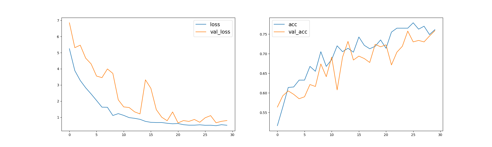
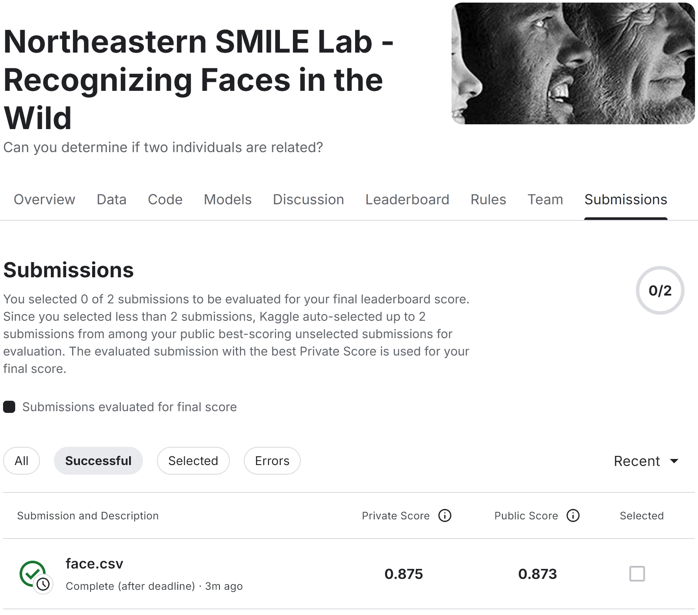

## Description

Competition: [Northeastern SMILE Lab - Recognizing Faces in the Wild](https://www.kaggle.com/c/recognizing-faces-in-the-wild)

[Execution Log](log.txt)



## Submission

Weights available on request (> 200 MB).

[CSV](submission.csv)



## Dependencies

WSL2

```shell
wsl.exe --install

wsl.exe --update
```

Brand new `Ubuntu 22.04.5 LTS` from the Microsoft Store

```shell
sudo apt update
sudo apt upgrade

sudo apt install -y python3.10-venv
```

CUDA Toolkit

```shell
wget https://developer.download.nvidia.com/compute/cuda/repos/wsl-ubuntu/x86_64/cuda-wsl-ubuntu.pin

sudo mv cuda-wsl-ubuntu.pin /etc/apt/preferences.d/cuda-repository-pin-600

wget https://developer.download.nvidia.com/compute/cuda/12.6.1/local_installers/cuda-repo-wsl-ubuntu-12-6-local_12.6.1-1_amd64.deb

sudo dpkg -i cuda-repo-wsl-ubuntu-12-6-local_12.6.1-1_amd64.deb

sudo cp /var/cuda-repo-wsl-ubuntu-12-6-local/cuda-*-keyring.gpg

/usr/share/keyrings/sudo apt-get update

sudo apt-get -y install cuda-toolkit-12-6
```

Libraries

```shell
python3 -m venv .venv
source .venv/bin/activate

# installs keras < 3.0.0
pip install "tensorflow[and-cuda]<2.16"

pip install git+https://github.com/yaledhlab/vggface.git

pip install keras_applications pandas matplotlib jupyter pillow "numpy<1.24" tqdm
```

## References

[CUDA on WSL User Guide](https://docs.nvidia.com/cuda/wsl-user-guide/index.html)

[CUDA Toolkit 12.6 Update 1 Downloads - WSL-Ubuntu](https://developer.nvidia.com/cuda-downloads?target_os=Linux&target_arch=x86_64&Distribution=WSL-Ubuntu&target_version=2.0&target_type=deb_local)

[@rcmalli's keras-vggface library updated to Tensorflow 2](https://github.com/yaledhlab/vggface)

[TensorFlow + Keras 2 backwards compatibility](https://keras.io/getting_started/)
